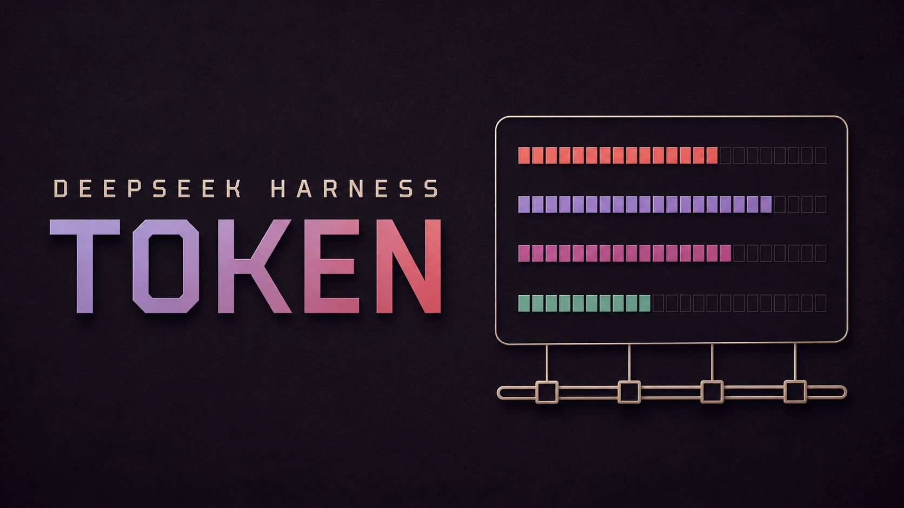

# @zoytown/dsh-token

English | [中文](README.zh.md)



`@zoytown/dsh-token` is a **[DeepSeek Harness](https://github.com/deepseek-ai/deepseek-harness) (`dsh`) plugin that reports your token usage across the whole machine**. It folds the session logs of every dsh home — `~/.dsh` and each `~/.dsh_desktop/<version>` — into a **Token** page in Settings: headline totals, a GitHub-style contribution heatmap, current and longest streaks, peak hour, and a per-model breakdown of the four disjoint token buckets. It registers **no model-facing tool** and appends **no session event**, so mounting it costs the conversation nothing.


## What it shows

- **Sessions**, **Messages**, **Total tokens**, **Active days**, current and longest **streak**, **peak hour**, and your most-used model
- A **contribution heatmap** of the last 53 weeks, or a day strip when a 7-day / 30-day window is selected
- A **Models** view splitting each model's usage into **input / cache read / cache write / output**

Everything is local and read-only: the plugin never writes to a session, never contacts a network service, and answers loopback callers only — the payload lists working directories, which is effectively a list of your projects.

## What it deliberately does not show

**Cost.** The harness stores no price table — `@deepseek-ai/dsh-llm-pi-ai` hardcodes `NO_COST` and its own comment states the harness never reads a provider's cost metadata. Any currency figure here would be a local guess dressed up as a fact. Account balance is a separate concern, covered by [`@zoytown/dsh-billing`](https://github.com/zoyluoblue/deepseek-harness-billing).

## Install

```sh
dsh plugin --profile web add @zoytown/dsh-token
```

Requires Node `^22.19 || >=24` and **pnpm** on `PATH` (`dsh plugin` is a thin pnpm forwarder). Then open **Settings → Token**.

No global `dsh` on your `PATH`? Either form works:

```sh
npx -y @deepseek-ai/dsh plugin --profile web add @zoytown/dsh-token   # published CLI
pnpm dsh plugin --profile web add @zoytown/dsh-token                  # from a harness checkout
```

Pick one and stay with it — both CLIs re-point the `<DSH_HOME>/profiles/node_modules` symlink farm at their own installation on every boot.

To remove it:

```sh
dsh plugin --profile web remove @zoytown/dsh-token
```

### Desktop shells are not supported

This plugin targets `dsh web`. An Electron shell wrapping the harness may pin bare module resolution to its own bundle, which makes a profile-installed plugin unresolvable — and the plugin tree then fails to load outright rather than degrading, so the app will not start. Do not install this plugin into such a shell's `DSH_HOME`. You do not need one anyway: sessions recorded under `~/.dsh_desktop/<version>/` are read from `dsh web` all the same.

## Configuration

Set on the `dsh-token` row in the profile's `cordis.patch.yml`:

| Key | Default | Meaning |
| --- | --- | --- |
| `extraSessionRoots` | `[]` | Extra dsh home directories to scan. Discovery covers `~/.dsh` and `~/.dsh_desktop/<version>`; a home reached through a `$DSH_HOME` that is not currently set needs listing here. |
| `includeCompaction` | `true` | Count tokens spent generating compaction summaries — real spend the harness's own `tokenUsage` projection cannot see. Set `false` to reconcile 1:1 with it. |
| `refreshIntervalMs` | `30000` | How often to re-scan for appended sessions. |
| `indexChunkYieldMs` | `16` | Cooperative yield interval during a scan. |

## How the numbers are defined

The rules matter more than the code, so they are stated plainly:

- **Total tokens includes cache reads.** The four provider buckets are disjoint, so their sum is the real throughput. The Models view splits them, because a total dominated by cache reads should be visible as such.
- **Sessions excludes subagent sessions, but their tokens are counted.** A delegated session is not one you opened; its count appears as a subtitle.
- **Messages means human plus non-empty assistant messages** — not log records. One step emits hundreds of streaming delta events, so a record count would be two to three orders of magnitude off.
- **A usage report arrives twice per step** — once while streaming, once on the final message. Samples are keyed by `(turn, step)` and **replaced**, never accumulated, matching the harness's own projection.
- **Days and hours use your local calendar**, computed with `Intl` rather than UTC millisecond arithmetic, and streaks are measured between noon anchors so a daylight-saving transition cannot break one.
- **Retried steps under-count.** When a provider request is retried inside a step the log keeps only the final usage report; the failed attempt was billed but its numbers are gone.

Metering coverage, retried steps, sessions still being written, and skipped logs are all disclosed in the page footer rather than silently absorbed.

## How it works

A full scan is not viable on the read path: folding ~1,200 sessions / ~319 MB of compressed logs takes about 4 s, and the cost is frame-bound rather than byte-bound, so a faster decompressor does not fix it. So the host half folds once in the background and afterwards reads only the bytes appended since, keyed on `(dev, ino, size, mtime)`. The browser half never sees a log byte — it renders a view model fetched from one loopback JSON route.

Session logs are a container of concatenated, independently decodable zstd frames, which is both why Node's stock zstd APIs cannot read them (they stop at the first frame) and why resuming from a stored byte cursor is sound.

## Development

```sh
npm install
npm run typecheck
npm run build
```

## License

MIT
