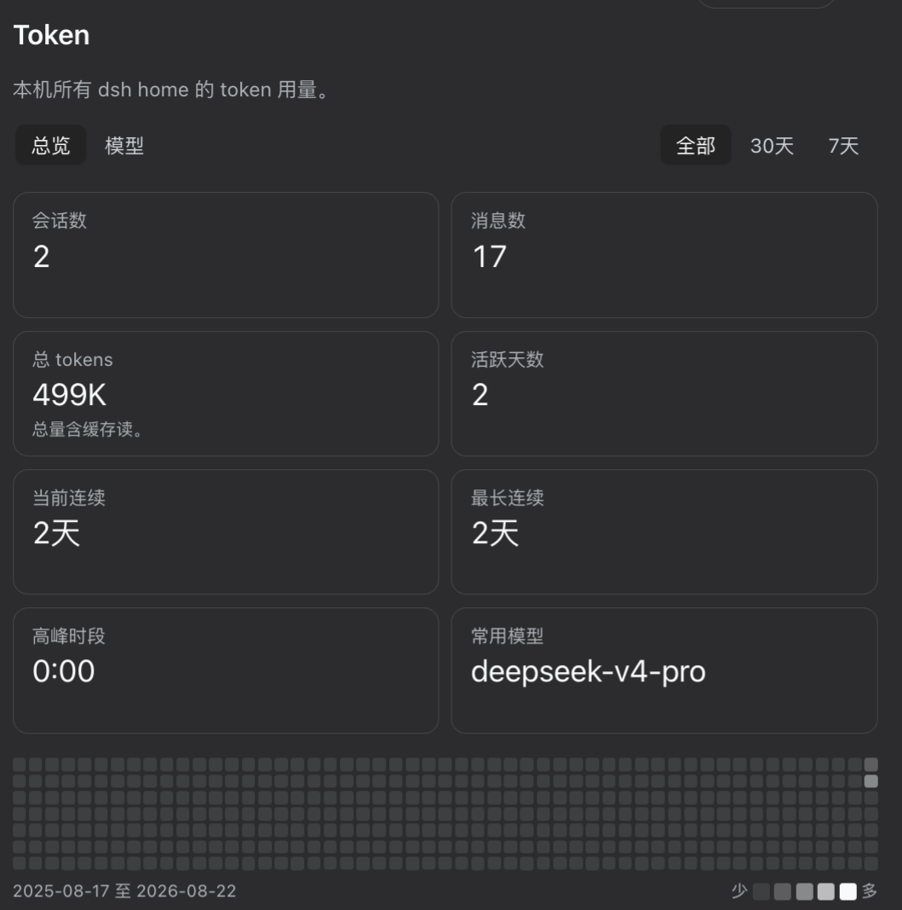

# @zoytown/dsh-token

[English](README.md) | 中文


`@zoytown/dsh-token` 是一个 **[DeepSeek Harness](https://github.com/deepseek-ai/deepseek-harness)（`dsh`）插件，统计本机全部 token 用量**。它把每一个 dsh home——`~/.dsh` 以及各个 `~/.dsh_desktop/<version>`——的会话日志折叠成设置里的一个 **Token** 页：总量指标卡、GitHub 式贡献热力图、当前与最长连续天数、高峰时段，以及按模型拆分的四个互斥 token 桶。它**不注册任何模型可见的工具**，**不追加任何会话事件**，所以挂上它对对话本身零开销。



## 展示什么

- **会话数**、**消息数**、**总 tokens**、**活跃天数**、**当前 / 最长连续天数**、**高峰时段**、**常用模型**
- 最近 53 周的**贡献热力图**；选 7 天 / 30 天时改为单行日条
- **模型**视图：把每个模型的用量拆成**输入 / 缓存读 / 缓存写 / 输出**

全程本地、只读：不写任何会话，不联网，且只答复 loopback 调用方——载荷里含工作目录路径，等于一份你的项目清单。

## 刻意不展示什么

**费用。** harness 里根本没有价格表——`@deepseek-ai/dsh-llm-pi-ai` 把 `NO_COST` 写死，其源码注释直言 harness 从不读 provider 的 cost 元数据。在这里给出任何金额，都只是把本地猜测包装成事实。账户余额是另一件事，由 [`@zoytown/dsh-billing`](https://github.com/zoyluoblue/deepseek-harness-billing) 负责。

## 安装

```sh
dsh plugin --profile web add @zoytown/dsh-token
```

需要 Node `^22.19 || >=24`，且 `PATH` 上有 **pnpm**（`dsh plugin` 是 pnpm 的薄转发层）。装完打开 **设置 → Token**。

`PATH` 上没有全局 `dsh`？两种写法都行：

```sh
npx -y @deepseek-ai/dsh plugin --profile web add @zoytown/dsh-token   # 发布版 CLI
pnpm dsh plugin --profile web add @zoytown/dsh-token                  # 在 harness 检出目录里
```

选一种并固定下来——两个 CLI 每次启动都会把 `<DSH_HOME>/profiles/node_modules` 那个软链农场重新指向自己那份安装。

卸载：

```sh
dsh plugin --profile web remove @zoytown/dsh-token
```

### 不支持桌面壳

本插件面向 `dsh web`。包装 harness 的 Electron 壳可能把裸模块解析锚定在自己的 bundle 上，导致装进 profile 的插件解析不到——而且**整棵插件树会直接加载失败**而不是降级，App 起不来。不要把本插件装进这类壳的 `DSH_HOME`。也不需要：记录在 `~/.dsh_desktop/<version>/` 下的会话，从 `dsh web` 一样读得到。

## 配置

写在 profile 的 `cordis.patch.yml` 里 `dsh-token` 那一行下：

| 键 | 默认值 | 含义 |
| --- | --- | --- |
| `extraSessionRoots` | `[]` | 额外扫描的 dsh home 目录。自动发现覆盖 `~/.dsh` 与 `~/.dsh_desktop/<version>`；曾经通过某个 `$DSH_HOME` 用过、但现在没有设置的 home 需要写在这里。 |
| `includeCompaction` | `true` | 是否计入压缩摘要消耗的 token——那是真实花费，而 harness 自带的 `tokenUsage` 投影看不见它。设为 `false` 可与之 1:1 对账。 |
| `refreshIntervalMs` | `30000` | 重新扫描新增会话的间隔。 |
| `indexChunkYieldMs` | `16` | 扫描时让出事件循环的间隔。 |

## 口径说明

规则比代码更重要，所以明写在这里：

- **总 tokens 含缓存读。** provider 报的四个桶互斥，相加就是真实吞吐量。模型页把它们拆开——一个被缓存读支配的总量，应该一眼能看出来。
- **会话数不含子会话，但子会话的 token 计入总量。** 委派出去的子会话不是你开的对话，它的数量以副标题单列。
- **消息数 = 人类消息 + 非空助手消息**，不是日志条数。单个步骤会产生上百条流式增量事件，按条数统计会差 2–3 个数量级。
- **同一步的用量会上报两次**——流式期间一次、最终消息上一次。样本按 `(turn, step)` 键控并**替换**，绝不累加，与 harness 自己的投影一致。
- **日 / 小时按本机日历分桶**，用 `Intl` 而不是 UTC 毫秒除法；连续天数按正午锚点判定，所以夏令时切换不会误判为断签。
- **重试步骤会少算。** 一个步骤内重试时，日志只保留最终那份用量报告；失败那次已经计费，但数字已经不在日志里。

计量覆盖率、重试步骤数、仍在写入的会话、被跳过的日志，全部在页面底部诚实披露，而不是悄悄吸收掉。

## 实现要点

读路径上做全量扫描不可行：折叠约 1,200 个会话 / 约 319 MB 压缩日志要 4 秒左右，且成本是**帧数**绑定而非字节绑定，换个更快的解压器也解决不了。所以 host 半在后台折叠一次，之后只读新追加的字节，靠 `(dev, ino, size, mtime)` 判定新鲜度。浏览器半永远看不到日志字节——它渲染的是从一条 loopback JSON 路由取回的 view model。

会话日志是**多个独立可解码的 zstd 帧拼接**而成的容器，这既是 Node 自带 zstd API 读不了它的原因（只能解出第一帧），也是从存储的字节游标处续读成立的原因。

## 开发

```sh
npm install
npm run typecheck
npm run build
```

## 许可证

MIT
